# Modern Voice Radio — Entity Relationship Diagram

Source of truth for the schema lives in [`backend/migrations`](../backend/migrations). This diagram is a
human-readable rendering of that schema. Regenerate/update it whenever a migration changes relationships.

```mermaid
erDiagram
    ROLES ||--o{ USERS : "assigned to"
    ROLES ||--o{ ROLE_PERMISSIONS : has
    PERMISSIONS ||--o{ ROLE_PERMISSIONS : grants
    USERS ||--o{ REFRESH_TOKENS : owns
    USERS ||--o{ PASSWORD_RESETS : requests
    USERS ||--o{ FAVORITES : saves
    USERS ||--o{ DOWNLOADS : downloads
    USERS ||--o{ LISTENING_HISTORY : generates
    USERS ||--o{ SONG_REQUESTS : submits
    USERS ||--o{ SCHEDULE_REMINDERS : sets
    USERS ||--o{ USER_NOTIFICATIONS : receives
    USERS ||--o{ CHAT_MESSAGES : posts
    USERS ||--o{ PODCAST_PROGRESS : tracks

    PRESENTERS ||--o{ PROGRAM_PRESENTERS : hosts
    PROGRAMS ||--o{ PROGRAM_PRESENTERS : "hosted by"
    PROGRAMS ||--o{ SCHEDULE : "aired via"
    SCHEDULE ||--o{ SCHEDULE_REMINDERS : "reminded for"

    PODCAST_CATEGORIES ||--o{ PODCASTS : groups
    PRESENTERS ||--o{ PODCASTS : hosts
    PODCASTS ||--o{ PODCAST_EPISODES : contains
    PODCAST_EPISODES ||--o{ PODCAST_PROGRESS : "progress on"
    PODCAST_EPISODES ||--o{ DOWNLOADS : "downloaded as"

    NEWS_CATEGORIES ||--o{ NEWS : groups
    USERS ||--o{ NEWS : authors

    NOTIFICATIONS ||--o{ USER_NOTIFICATIONS : "delivered as"

    AUDIO_STREAMS ||--o{ LISTENER_SESSIONS : streams
    USERS ||--o{ LISTENER_SESSIONS : "listens via"

    CHAT_MESSAGES ||--o{ CHAT_MESSAGES : "replies to"
    USERS ||--o{ CHAT_BANS : "banned as"

    USERS {
        uuid id PK
        uuid role_id FK
        varchar full_name
        citext email
        varchar password_hash
        varchar provider
        boolean is_verified
        boolean is_active
    }

    ROLES {
        uuid id PK
        varchar name
        boolean is_system
    }

    PERMISSIONS {
        uuid id PK
        varchar code
        varchar module
    }

    PRESENTERS {
        uuid id PK
        varchar full_name
        varchar slug
        jsonb socials
    }

    PROGRAMS {
        uuid id PK
        varchar title
        varchar slug
        varchar category
    }

    SCHEDULE {
        uuid id PK
        uuid program_id FK
        smallint day_of_week
        time start_time
        time end_time
    }

    PODCASTS {
        uuid id PK
        uuid category_id FK
        uuid presenter_id FK
        varchar title
        varchar slug
    }

    PODCAST_EPISODES {
        uuid id PK
        uuid podcast_id FK
        varchar title
        text audio_url
        integer duration_seconds
    }

    NEWS {
        uuid id PK
        uuid category_id FK
        uuid author_id FK
        varchar title
        boolean is_breaking
    }

    GALLERY {
        uuid id PK
        varchar media_type
        text media_url
        varchar event_name
    }

    NOTIFICATIONS {
        uuid id PK
        varchar title
        varchar type
        jsonb data
    }

    ADVERTISEMENTS {
        uuid id PK
        varchar title
        text image_url
        varchar placement
    }

    SONG_REQUESTS {
        uuid id PK
        uuid user_id FK
        varchar song_title
        varchar status
    }

    FAVORITES {
        uuid id PK
        uuid user_id FK
        varchar entity_type
        uuid entity_id
    }

    DOWNLOADS {
        uuid id PK
        uuid user_id FK
        uuid episode_id FK
        varchar status
    }

    AUDIO_STREAMS {
        uuid id PK
        varchar protocol
        text url
        integer bitrate_kbps
    }

    LISTENER_SESSIONS {
        uuid id PK
        uuid user_id FK
        uuid stream_id FK
        varchar country
        varchar city
    }

    SETTINGS {
        uuid id PK
        varchar key
        jsonb value
    }

    CONTACT_INFORMATION {
        uuid id PK
        varchar station_name
        double latitude
        double longitude
    }

    CHAT_MESSAGES {
        uuid id PK
        uuid user_id FK
        text message
        boolean is_pinned
    }
```

## Notes

- All primary keys are `UUID` generated via `gen_random_uuid()` (pgcrypto/core, PostgreSQL ≥ 13).
- `favorites` and `listening_history` are intentionally polymorphic (`entity_type` + `entity_id`) rather than
  one join table per content type, to keep the mobile "Favorites" and "History" screens backed by a single query.
- `listener_sessions` + `analytics_daily` power the Admin Dashboard's live listener map, country/city/device
  breakdowns and historical trend charts. `analytics_daily` is a rollup populated by a nightly job
  (see [`backend/src/jobs/rollupAnalytics.js`](../backend/src/jobs/rollupAnalytics.js)).
- Every mutable table has an `updated_at` column maintained by the shared `set_updated_at()` trigger
  defined in migration `001_extensions_roles_permissions.sql`.
